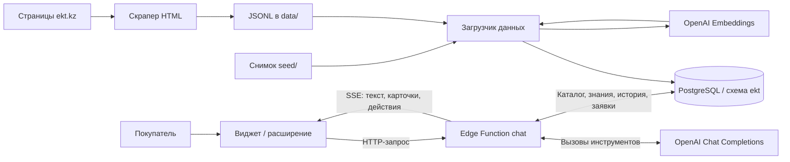

# EKT AI-консультант

ИИ-консультант для интернет-магазина электротехники [ekt.kz](https://ekt.kz/). Проект команды **Centras AI HUB** для хакатона BAITC.

Консультант помогает подобрать товар, узнать характеристики и условия покупки, найти филиал и подготовить заявку. Он использует данные каталога и информационных страниц магазина, а при подключении к ekt.kz умеет выполнять ограниченный набор действий на странице.

**Текущий формат демонстрации — расширение Chrome/Edge.** У команды сейчас нет доступа к среде сайта для прямого внедрения, поэтому расширение подключает консультанта к ekt.kz в браузере проверяющего. Код сайта при этом менять не требуется. Для штатного подключения предусмотрен тот же виджет через `<script>`; необходимые доступы перечислены в разделе установки.

**Для жюри:** [установить расширение](#быстрая-установка-расширения-для-жюри) · [сценарий проверки](#8-как-проверить-решение) · [свой сервер и база](#требования-для-сборки-и-собственного-сервиса) · [пример переменных окружения](.env.example).

## 1. Название проекта

**EKT AI-консультант** (`ekt-ai-consultant` в `package.json`).

## 2. Какую проблему решает проект

Покупателю электротехники нужно сопоставить характеристики, цену и условия покупки: например, найти лампу с нужным цоколем, мощностью и температурой света. Эти сведения находятся в разных карточках и разделах сайта.

Проект объединяет поиск товаров и справочную информацию в одном диалоге. Он предназначен для розничных и оптовых покупателей ekt.kz. Для магазина предусмотрен сбор заявок с контактами и описанием потребности; заявленные преимущества по конверсии или снижению нагрузки на менеджеров в репозитории не измерялись.

## 3. Что реализовано

| Возможность | Реализация |
| --- | --- |
| Подбор товаров | Поиск по запросу и артикулу; фильтры по бренду, категории, бюджету и характеристикам. Карточки с ценой, артикулом и ссылкой на источник. |
| Ответы о магазине | Поиск по информационным страницам: оплата, доставка, возврат, оформление заказа; отдельный инструмент для адресов и контактов филиалов. |
| Диалог | Потоковый ответ, контекст предыдущих сообщений, подсказки для продолжения, оценки ответов. Интерфейс и инструкции для русского, казахского и английского языков. |
| Действия на сайте | Переход к товару или служебной странице, подсветка элементов, заполнение и отправка поиска, нажатие «Купить», открытие и заполнение разрешённых форм. Перед переходом и нажатием есть возможность отмены. Формы заявки и покупки в один клик пользователь отправляет самостоятельно. |
| Заявка менеджеру | Инструмент `create_lead` записывает контакт и запрос в таблицу `ekt.leads`. Промпт требует согласия покупателя; сервер проверяет телефон и ограничивает число заявок. |
| Подключение к сайту | Виджет через `<script>` и распаковываемое расширение Chrome/Edge Manifest V3. История диалога восстанавливается после переходов. |
| Подготовка данных | Скрапер HTML, загрузка в базу, разбиение страниц на фрагменты, эмбеддинги, журнал обновлений и история изменения цен. |
| Проверки | Модульные тесты, проверка типов, smoke-тест API, набор eval-сценариев, браузерные E2E-сценарии и конфигурация CI. |

Реализация функций не означает, что все сценарии проходят без ошибок: результаты сохранённых прогонов и ограничения приведены ниже.

В сервере реализовано **12 инструментов**, доступных модели — см. [`tools.ts`](supabase/functions/chat/tools.ts):

| Инструмент | Конкретная функция |
| --- | --- |
| `search_products` | Найти товары по запросу с фильтрами по цене, бренду, категории и характеристикам |
| `get_product` | Получить подробную карточку конкретного товара |
| `category_facets` | Узнать, какие характеристики и значения есть у товаров выбранной категории |
| `list_categories` | Получить корневые разделы и подкатегории каталога |
| `search_knowledge` | Найти фрагменты информационных страниц с заголовками и ссылками |
| `get_branches` | Найти адрес, телефон, email и часы работы филиала по городу |
| `create_lead` | Сохранить заявку с контактами и потребностью в базе проекта |
| `navigate_to` | Открыть разрешённую страницу ekt.kz, например карточку товара или условия возврата |
| `highlight` | Подсветить цену, характеристики, телефон, кнопку или другой разрешённый элемент |
| `click_element` | Нажать «Купить», выполнить поиск либо открыть форму заявки или покупки в один клик |
| `fill_form` | Заполнить разрешённые поля поиска, заявки или покупки в один клик; формы обращения не отправляются автоматически |
| `suggest_replies` | Показать варианты следующего сообщения покупателя |

## 4. Как работает решение

Пример запроса: **«Нужна светодиодная лампа E27, тёплый свет, до 1000 тенге»**.

1. Покупатель открывает виджет и отправляет сообщение. Виджет передаёт текст, идентификатор диалога и контекст страницы в API чата.
2. Сервер добавляет историю диалога и инструкции консультанта. Модель выбирает инструменты: например, поиск товаров или получение карточки по артикулу.
3. Инструменты получают сведения из PostgreSQL. Поиск объединяет точное совпадение артикула, полнотекстовый поиск, обработку опечаток и векторное сходство.
4. Модель формирует ответ на основе найденных данных. Виджет получает текст через SSE и отображает карточки найденных товаров.
5. По следующей просьбе — например, «Открой карточку» — сервер может передать разрешённое действие интерфейсу. На ekt.kz виджет выполняет его; на отдельной демостранице переход к ekt.kz предлагается ссылкой.
6. Если вопрос требует участия менеджера, консультант может собрать данные для заявки. Запись заявки в БД и заполнение формы на сайте — разные механизмы; отправка формы остаётся за покупателем.

После генерации сервер сверяет цены, ссылки и заявления о действиях с результатами инструментов. Несоответствия сохраняются как диагностические флаги, но уже показанный текст автоматически не исправляется.

## 5. Технологии

| Компонент | Технологии |
| --- | --- |
| Языки | TypeScript, JavaScript, SQL, HTML, CSS |
| Скрапер и служебные скрипты | Node.js, `tsx`, Cheerio, dotenv |
| Сервер чата | Supabase Edge Functions, Deno 2, OpenAI Chat Completions API с вызовом инструментов |
| AI-модели по умолчанию | `gpt-4.1-mini` для диалога; `text-embedding-3-small` для эмбеддингов размерности 1536 |
| Данные и поиск | Supabase PostgreSQL, схема `ekt`, `pgvector`, `pg_trgm`, полнотекстовый поиск `russian`, Reciprocal Rank Fusion. В локальной конфигурации указан PostgreSQL 17. |
| Клиент | TypeScript без UI-фреймворка, Shadow DOM, SSE, `localStorage`; сборка esbuild |
| Расширение браузера | Chrome Extension Manifest V3, подключение того же виджета к ekt.kz |
| Проверки | Vitest, happy-dom, Deno test/check, Playwright Core и установленный браузер для E2E |
| Окружение | npm, Supabase CLI, Docker для локального Supabase; GitHub Actions; конфигурация публикации статики в Vercel |

Версии зависимостей зафиксированы в [package-lock.json](package-lock.json). Модели и серверные параметры задаются через окружение; смена модели эмбеддингов должна учитывать размерность в схеме БД.

## 6. Архитектура проекта



| Путь | Назначение |
| --- | --- |
| [`scraper/src/`](scraper/src/) | Сбор и разбор страниц, подготовка записей, загрузка данных и эмбеддингов |
| [`seed/`](seed/) | Снимок данных для воспроизведения без повторного обхода ekt.kz |
| [`supabase/migrations/`](supabase/migrations/) | Таблицы, права доступа и SQL-функции поиска |
| [`supabase/functions/chat/`](supabase/functions/chat/) | API, промпт, 12 инструментов, клиент OpenAI, SSE, ограничения запросов и постпроверка |
| [`web/src/`](web/src/) | Чат-виджет, локализация, сохранение диалога и выполнение действий |
| [`web/public/`](web/public/) | Демо, страница проверки встраивания и результат сборки `widget.js` |
| [`extension/`](extension/) | Расширение для подключения виджета к настоящему сайту |
| [`scripts/`](scripts/) | Локальная установка, smoke-тест, проверка поиска, обновление снимка |
| [`eval/`](eval/), [`e2e/`](e2e/) | Проверки ответов и пользовательских сценариев |
| [`.github/workflows/`](.github/workflows/) | CI и расписание обновления данных |

Браузер обращается к функции чата, а не напрямую к таблицам. Ключ OpenAI и ключ Supabase `service_role` нужны серверу и загрузчику данных; в настройки виджета они не передаются.

## 7. Установка и запуск

### Быстрая установка расширения для жюри

**В системе нужны:** Chrome или Microsoft Edge с возможностью загрузки распакованного расширения, доступ к интернету, ekt.kz и облачному API команды. Готовая сборка [`extension/widget.js`](extension/widget.js) уже находится в репозитории: для её установки Node.js, Docker, аккаунт Supabase и собственный ключ OpenAI не нужны.

1. Скачайте репозиторий через **Code → Download ZIP** и распакуйте архив либо клонируйте его через Git.
2. Откройте `chrome://extensions` в Chrome или `edge://extensions` в Edge.
3. Включите **«Режим разработчика»**.
4. Нажмите **«Загрузить распакованное»** и выберите именно папку `extension/`, содержащую `manifest.json`, `content.js`, `widget.js` и `icons/`.
5. Откройте или обновите [категорию «Лампы» на ekt.kz](https://ekt.kz/catalog/svetilniki_lampy/lampy/). Справа внизу должна появиться кнопка **«Задать вопрос»**.
6. Отправьте: «Покажи цену и характеристики товара с артикулом 080300163_», затем «Открой карточку и покажи цену».

Расширение действует только на `https://ekt.kz/*` и `https://www.ekt.kz/*`. Оно использует API из [`extension/content.js`](extension/content.js). Если виджет появился, но ответа нет, проверьте [health API](https://gqdwplbvxopanapxzlaw.supabase.co/functions/v1/chat/health); для независимого от стенда команды запуска используйте вариант B или C ниже. В управляемом корпоративном браузере загрузка расширений может требовать разрешения администратора.

### Требования для сборки и собственного сервиса

- **Node.js 22.12+ в ветке 22 либо Node.js 24**, npm, Git. Хотя `package.json` объявляет Node.js ≥20, текущие зависимости в lock-файле требуют более новую версию.
- Для полноценного локального сервиса: запущенный Docker Desktop или совместимый Docker Engine, интернет для загрузки образов и запросов OpenAI, собственный `OPENAI_API_KEY` с доступом к указанным моделям.
- Supabase CLI входит в зависимости проекта; команды вызываются через `npx supabase`.
- Отдельный Deno 2 нужен для `deno check` и `deno test`, но не для запуска функции через Supabase CLI.

```sh
git clone https://github.com/BAITC-Hacks/hack-b0093e63-centras-ai-hub.git
cd hack-b0093e63-centras-ai-hub
npm ci
```

Выберите один из трёх вариантов ниже. **Для воспроизведения всей цепочки с собственной базой используйте вариант B.**

### A. Демонстрация интерфейса без ключей и Docker

В первом терминале:

```sh
node web/dev/mock-server.mjs
```

Во втором терминале, из корня проекта:

```sh
npm run dev:web
```

Откройте [демо с mock API](http://localhost:5173/?api=http://localhost:8787) или [страницу проверки действий](http://localhost:5173/embed.html).

Mock API работает на порту `8787` и возвращает заранее заданные ответы. Этот режим позволяет проверить интерфейс и действия, но не качество AI, поиск по базе или создание настоящих заявок.

### B. Полный локальный сервис: база → данные → API → виджет

**Шаг 1. Создайте локальный файл настроек из [`.env.example`](.env.example).**

PowerShell:

```powershell
Copy-Item .env.example .env.local
```

Bash / zsh:

```sh
cp .env.example .env.local
```

Отредактируйте `.env.local`: заполните `OPENAI_API_KEY`, оставьте модели по умолчанию и `ALLOWED_ORIGINS`. Для этого варианта удалите строки `SUPABASE_*` с облачными заглушками: адреса и ключи локального Supabase определит CLI. Не используйте терминал с экспортированными переменными чужого облачного проекта.

| Переменная | Что указать |
| --- | --- |
| `OPENAI_API_KEY` | Собственный секретный ключ OpenAI, обязателен для настоящего чата |
| `OPENAI_MODEL` | `gpt-4.1-mini` |
| `OPENAI_EMBEDDING_MODEL` | `text-embedding-3-small` |
| `ALLOWED_ORIGINS` | Значение из примера уже включает `http://localhost:5173`, `https://ekt.kz` и `https://www.ekt.kz` |
| `CHAT_URL` | Можно оставить пустым; для smoke/eval ниже адрес задаётся явно |

**Шаг 2. Запустите Docker и подготовьте базу.**

```sh
npm run setup:local
```

Скрипт проверяет Docker, запускает Supabase, применяет миграции и загружает `seed/`, создавая эмбеддинги через OpenAI. Локальные реквизиты записываются в `.env.local.generated`; исходный `.env.local` сохраняется.

> `setup:local` выполняет `supabase db reset --local`: повторный запуск удаляет данные локальной БД и загружает снимок заново. Для обычного возобновления контейнеров используйте `npx supabase start`.

Без ключа OpenAI скрипт может загрузить данные без эмбеддингов, но полноценный AI-чат от этого не заработает. Вариант `npm run setup:local -- --no-embed` пропускает создание эмбеддингов при первоначальной загрузке.

**Шаг 3. В отдельном терминале запустите API и оставьте его работающим.**

```sh
npm run serve:fn
```

Команда читает `.env.local`. Локальный адрес API: `http://127.0.0.1:54321/functions/v1/chat`.

**Шаг 4. В ещё одном терминале запустите интерфейс.**

```sh
npm run dev:web
```

Откройте [локального консультанта](http://localhost:5173/?api=http://127.0.0.1:54321/functions/v1/chat). Параметр `?api=` обязателен для этого варианта: без него демостраница использует сохранённый облачный API команды.

| Компонент | Локальный адрес |
| --- | --- |
| Демо | [localhost:5173](http://localhost:5173/?api=http://127.0.0.1:54321/functions/v1/chat) |
| Проверка API | [chat/health](http://127.0.0.1:54321/functions/v1/chat/health) |
| Supabase Studio | [127.0.0.1:54323](http://127.0.0.1:54323) |

В ответе `/health` проверьте `ok: true`, `db: true`, `openai_key: true`. Последнее поле подтверждает наличие ключа в настройках, а не успешный запрос к OpenAI; это проверяется сообщением в чат или smoke-тестом.

Для повторной загрузки снимка без сброса БД:

```sh
node --env-file=.env.local.generated --import tsx scraper/src/ingest.ts --dir seed
```

Здесь локальные реквизиты передаются загрузчику явно: `ingest` сам не читает `.env.local.generated`. Не экспортируйте облачные `SUPABASE_*` в этом терминале — переменные процесса имеют приоритет над файлом.

Для остановки завершите процессы API и интерфейса через `Ctrl+C`, затем выполните `npx supabase stop`.

### C. Собственный облачный Supabase

1. Создайте проект Supabase. Скопируйте [`.env.example`](.env.example) в `.env.local` и заполните `SUPABASE_URL`, `SUPABASE_SERVICE_ROLE_KEY`, `OPENAI_API_KEY`. Project ref и пароль БД понадобятся при привязке CLI.
2. Авторизуйте CLI и примените миграции:

   ```sh
   npx supabase login
   npx supabase link --project-ref <project-ref>
   npm run db:push
   ```

   Команда `link` может запросить пароль базы. Supabase CLI не получает все переменные автоматически из `.env.local`; для авторизации здесь используется `login`.

3. В настройках Data API проекта добавьте `ekt` в **Exposed schemas**, затем загрузите снимок:

   ```sh
   npm run ingest:seed
   ```

4. Создайте `.env.function.local` с `OPENAI_API_KEY`, `OPENAI_MODEL`, `OPENAI_EMBEDDING_MODEL` и `ALLOWED_ORIGINS`. Это отдельный файл только для секретов функции; не копируйте туда токен CLI, пароль БД или `SUPABASE_*`. Укажите в `ALLOWED_ORIGINS` фактические адреса страниц с виджетом.

   ```sh
   npx supabase secrets set --env-file .env.function.local
   npm run fn:deploy
   ```

5. Задайте собственный URL `https://<project-ref>.supabase.co/functions/v1/chat` в `<meta name="ekt-api">` файла [`web/public/index.html`](web/public/index.html). Для расширения замените `API` в [`extension/content.js`](extension/content.js). Параметр `?api=` демостраницы принимает только локальные HTTP-адреса и не переключает её на произвольный облачный проект.
6. Выполните `npm run smoke`, затем `npm run dev:web` и откройте [демо](http://localhost:5173/). Для smoke оставьте `CHAT_URL` пустым либо задайте свой адрес явно, чтобы он соответствовал выбранному проекту.

### Подключение на настоящий сайт

Для демонстрации используйте [готовое расширение](#быстрая-установка-расширения-для-жюри). Если меняли исходники виджета, сначала пересоберите его:

```sh
npm run build:web
```

Сборка создаёт `web/public/widget.js` и обновляет `extension/widget.js`. Откройте `chrome://extensions` или `edge://extensions`, включите режим разработчика, выберите «Загрузить распакованное» и укажите папку `extension/`. После этого откройте [категорию «Лампы»](https://ekt.kz/catalog/svetilniki_lampy/lampy/).

Подробности — в [инструкции расширения](extension/README.md). По умолчанию оно подключается к облачному API команды. Для собственного API измените `extension/content.js` и перезагрузите расширение.

**Что потребуется от владельца системы для прямого внедрения:**

- Доступ к шаблону сайта, чтобы подключить скрипт виджета, и возможность проверить его на тестовой странице.
- HTTPS-хостинг для `widget.js` и работающий HTTPS API чата.
- Настроенный Supabase со схемой `ekt`, миграциями и загруженными данными; серверный ключ OpenAI. Порядок — вариант C, переменные — [`.env.example`](.env.example).
- Добавление домена сайта в `ALLOWED_ORIGINS`; если на сайте действует Content Security Policy, разрешение загрузки скрипта и подключения к API.
- Проверка соответствия разметки сайта разрешённым целям в [`web/src/actions.ts`](web/src/actions.ts). Для другого сайта потребуется адаптация селекторов и серверного списка разрешённых адресов и действий.

После получения доступа разместите `widget.js` на HTTPS-хостинге и добавьте в шаблон страницы:

```html
<script src="https://<хостинг-виджета>/widget.js"
        data-api="https://<project-ref>.supabase.co/functions/v1/chat"
        data-lang="ru"
        defer></script>
```

Для публикации демо подготовлен [`vercel.json`](vercel.json): команда сборки `npm run build:web`, каталог публикации `web/public`. Сам конфигурационный файл не подтверждает, что сайт опубликован.

## 8. Как проверить решение

### Сценарий для жюри

Основной путь для жюри — [установить расширение](#быстрая-установка-расширения-для-жюри) и пройти сценарий на ekt.kz. Оно использует API команды; альтернативно можно развернуть собственный API по варианту B или C. Mock-режим для проверки поиска не подходит.

| Шаг | Действие | Что проверить |
| --- | --- | --- |
| 1 | «Нужна светодиодная лампа E27, тёплый свет, до 1000 тенге» | Ответ содержит найденные товары, цены в тенге и ссылки на ekt.kz. Сравните характеристики с карточками. |
| 2 | «Покажи цену и характеристики товара с артикулом 080300163_» | В снимке это PHILIPS Ecohome A60, E27, 11 Вт, 3000 K; `price_site` равна 800 ₸. Для обновлённой базы цена может отличаться. |
| 3 | «Какие условия возврата?» | Консультант использует информационные страницы магазина. |
| 4 | «Где ваш филиал в Астане?» | Ответ содержит адрес и контакты из данных филиалов. |
| 5 | «Найди товар с артикулом TEST-NOT-EXIST-999» | Проверка реакции на отсутствие данных: консультант не должен придумывать карточку и цену. |

Чтобы проверить действия **на ekt.kz с расширением**, попросите открыть найденную карточку, затем показать цену. Для проверки формы попросите открыть заявку: проверьте её отображение и возможность заполнения. Нажатие «Купить» может изменить настоящую корзину, а отправка формы — создать обращение на сайте. Для демонстрации этих действий без обращения в магазин используйте локальный `embed.html` с mock API.

### Автоматические проверки

Тесты и проверка типов без обращения к живому AI:

```sh
npm test
npm run typecheck
npm run build:web
```

При установленном Deno 2:

```sh
deno check supabase/functions/chat/index.ts
deno test supabase/functions/chat/
```

Smoke-тест и eval обращаются к работающему API. Для локального сервиса задайте адрес явно.

PowerShell:

```powershell
$env:CHAT_URL = "http://127.0.0.1:54321/functions/v1/chat"
npm run smoke
npm run eval
```

Bash / zsh:

```sh
export CHAT_URL=http://127.0.0.1:54321/functions/v1/chat
npm run smoke
npm run eval
```

`smoke` проверяет health, ответ с товаром и ссылкой, а также обработку некорректного запроса. `eval` выполняет сценарии из [`eval/questions.json`](eval/questions.json), перезаписывает `eval/report.json` и завершается с ошибкой при результате ниже 80%. Eval автоматически читает `.env`, но не `.env.local`, поэтому выше используется явный `CHAT_URL`. Сценарий `lead-flow-wholesale` создаёт тестовую запись в `ekt.leads`.

Дополнительно доступны `npm run e2e:api` для контракта действий API и `npm run e2e` для браузерных сценариев на настоящем ekt.kz. Браузерный прогон требует установленного Chrome/Edge и сборки виджета; он может добавить товар в реальную корзину тестового браузера и обновляет файлы отчётов и скриншотов.

**Сохранённые результаты, а не гарантия текущего состояния:**

- [`eval/RESULTS.md`](eval/RESULTS.md): 41 из 42 сценариев, 97,6%, прогон от 23.09.2026. Зафиксирована ошибка подбора лампы по сочетанию характеристик.
- [`e2e/RESULTS.md`](e2e/RESULTS.md): последний сохранённый браузерный прогон — 12 из 13 проверок, итог `FAIL`, от 23.09.2026; предыдущий — 10 из 13. Отмечены нестабильные карточка/ссылка в ответе и подсветка. В том же отчёте указаны 64 из 64 успешных проверок контракта API; это отдельный результат, не замена браузерной проверке.
- [`docs/README-VERIFICATION.md`](docs/README-VERIFICATION.md): журнал проверки более раннего коммита; полный локальный Docker-стек в том прогоне не запускался.

После изменений кода или данных эти проверки необходимо повторить. Сохранённые отчёты не доказывают ни наличие, ни исправление тех же ошибок в текущей рабочей копии.

## 9. Данные и интеграции

### Данные для воспроизведения

В [`seed/`](seed/README.md) хранится снимок ekt.kz от **23.09.2026**:

| Файл | Содержимое | Число записей |
| --- | --- | ---: |
| [`products.jsonl`](seed/products.jsonl) | Товары демонстрационной выборки категории «Лампы» | 89 |
| [`categories.jsonl`](seed/categories.jsonl) | Категории и пути каталога | 24 |
| [`pages.jsonl`](seed/pages.jsonl) | Информационные страницы | 123 |
| [`branches.json`](seed/branches.json) | Филиалы | 9 |

Это статический снимок, а не весь ассортимент магазина. Фрагменты страниц и эмбеддинги создаются при загрузке; готовые векторы в снимок не включены.

**Какие именно данные доступны:**

- **Товары:** светодиодные, галогенные, газоразрядные, люминесцентные, бактерицидные лампы и лампы накаливания. В характеристиках встречаются цоколи `E14`, `E27`, `E40`, `GX53`, `GU10`, `GU5.3`, `R7s`, `G13`; бренды MEGALIGHT, OSRAM, KODAK, Philips, IEK, Gauss. У части записей бренд или отдельные характеристики не заполнены.
- **Поля товара:** название, артикул и артикул поставщика, бренд, цена сайта и магазина в KZT, кратность покупки, описание, характеристики, категория, ссылка и URL изображения. Например, у лампы Philips `080300163_` в снимке указаны E27, 11 Вт, 3000 K и цена сайта 800 ₸.
- **Информационные страницы:** FAQ, оформление заказа, оплата, возврат и контакты; «О компании», собственные торговые марки, производство, технические материалы, статьи и новости. Например, есть страницы «Производство электрощитового оборудования» и «Кабельно-проводниковая продукция». Упоминание кабеля в справочной статье не означает, что его товарная карточка загружена в каталог.
- **Филиалы:** Алматы, Астана, Шымкент, Актау, Атырау, Тараз, Усть-Каменогорск, Караганда и Талдыкорган. Записи содержат адреса, телефоны, email и график работы.

Эти количества описывают файлы в репозитории. Состав работающей облачной БД может отличаться после обновлений и здесь отдельно не подтверждается.

### Внешние системы

| Система | Использование |
| --- | --- |
| ekt.kz | Sitemap, HTML карточек и информационных страниц, контакты филиалов, ссылки и изображения товаров. Сбор данных выполняется парсерами без LLM. |
| OpenAI API | Генерация ответов, выбор инструментов и создание эмбеддингов. Полный локальный запуск также обращается к этому внешнему сервису. |
| Supabase | Хранение каталога, знаний, диалогов, оценок, заявок и истории цен; SQL-поиск и API чата. Можно использовать облачный проект либо локальные контейнеры. |
| GitHub Actions | CI и подготовленное расписание обновления категории «Лампы»; требует настройки секретов репозитория. |
| Vercel | Подготовлена конфигурация хостинга демо и виджета; подтверждённого адреса публикации в репозитории нет. |

### Обновление данных

Настройки категории, ограничения числа товаров и частоты запросов приведены в [`.env.example`](.env.example). Скопированный пример настраивает сбор категории «Лампы» с лимитом 100 товаров.

```sh
npm run scrape
npm run ingest
```

`npm run refresh` выполняет обе команды последовательно. Сбор сохраняет результат в `data/`, загрузчик читает реквизиты из `.env.local` / `.env`. Для **локальной** БД после `setup:local` вместо обычного `npm run ingest` используйте:

```sh
node --env-file=.env.local.generated --import tsx scraper/src/ingest.ts
```

Загрузчик сравнивает содержимое записей, обновляет эмбеддинги и сохраняет изменения цен в `ekt.price_history`. Команда `npm run seed:update` отдельно заменяет файлы снимка в репозитории результатом из `data/`.

Workflow [`refresh-data.yml`](.github/workflows/refresh-data.yml) задаёт ежедневный запуск в `22:15 UTC` (`03:15` по Алматы) для категории «Лампы». Нужны секреты `SUPABASE_URL`, `SUPABASE_SERVICE_ROLE_KEY`, `OPENAI_API_KEY`. Наличие workflow не подтверждает, что секреты настроены или обновления фактически выполняются.

Скрапер содержит исключения для служебных страниц, закрытых в `robots.txt`. Переменная `SCRAPER_SKIP_SERVICE_PAGES=1` отключает их сбор.

## 10. Ограничения текущей версии

- **Ограниченный каталог.** Снимок содержит 89 товаров; ответы о других категориях зависят от данных, загруженных в конкретную БД.
- **Нет оперативных складских остатков.** Цена — значение из последней загрузки, а не гарантия текущей цены или наличия. Отдельной интеграции с учётной системой магазина нет.
- **Ошибки AI возможны.** Качество подбора зависит от поиска и модели. Постпроверка сохраняет диагностические флаги после генерации, но не блокирует неверный ответ.
- **Действия зависят от сайта.** Виджет использует селекторы текущей разметки ekt.kz; изменения сайта могут нарушить подсветку и заполнение. Выдача сервером команды не подтверждает её успешное выполнение браузером.
- **Заявки хранятся в БД.** Отдельного кабинета менеджера, интеграции CRM и автоматической отправки заявок по email или в мессенджер в текущей реализации нет. Их можно просматривать в таблице `ekt.leads` через Supabase Studio.
- **Согласие контролируется не полностью.** Запрос согласия предусмотрен промптом; отдельной серверной проверки факта согласия для `create_lead` нет.
- **История и контакты сохраняются.** Диалоги записываются на сервере и в браузере; введённые в чат персональные данные могут попасть в историю сообщений, а не только в заявку.
- **Есть лимиты.** До 2000 символов в сообщении, 12 предыдущих сообщений в контексте, 5 раундов инструментов, 20 сообщений в минуту на сессию, 60 на IP и 3 заявки на сессию — см. [`config.ts`](supabase/functions/chat/config.ts).
- **Требуются внешние сервисы.** Для настоящего чата нужен работающий OpenAI API; локальная база не делает решение полностью автономным. Mock-режим не заменяет AI-проверку.
- **Не все способы запуска подтверждены сквозным прогоном.** Инструкция локального Docker-стека составлена по скриптам и конфигурации. Сохранённый журнал верификации не подтверждает полный запуск этого варианта; браузерный отчёт содержит неуспешные проверки.

## 11. Развёрнутая версия

В исходниках демостраницы и расширения указан следующий адрес; в репозитории есть отчёты обращений к нему от 23.09.2026:

| Компонент | Ссылка / способ доступа |
| --- | --- |
| Облачный API чата | [Supabase Edge Function chat](https://gqdwplbvxopanapxzlaw.supabase.co/functions/v1/chat) — `POST`, ответ SSE; это не веб-страница чата |
| Проверка состояния | [Health-check](https://gqdwplbvxopanapxzlaw.supabase.co/functions/v1/chat/health) |
| Интерфейс для этого API | `npm ci` → `npm run dev:web` → [localhost:5173](http://localhost:5173/) без параметра `?api=` |
| Консультант поверх ekt.kz | [Инструкция установки расширения](extension/README.md) |

Текущая доступность облачного API при обновлении этого README не проверялась. Подтверждённой ссылки на опубликованную демостраницу и подтверждения штатного подключения виджета владельцем ekt.kz в репозитории нет.
